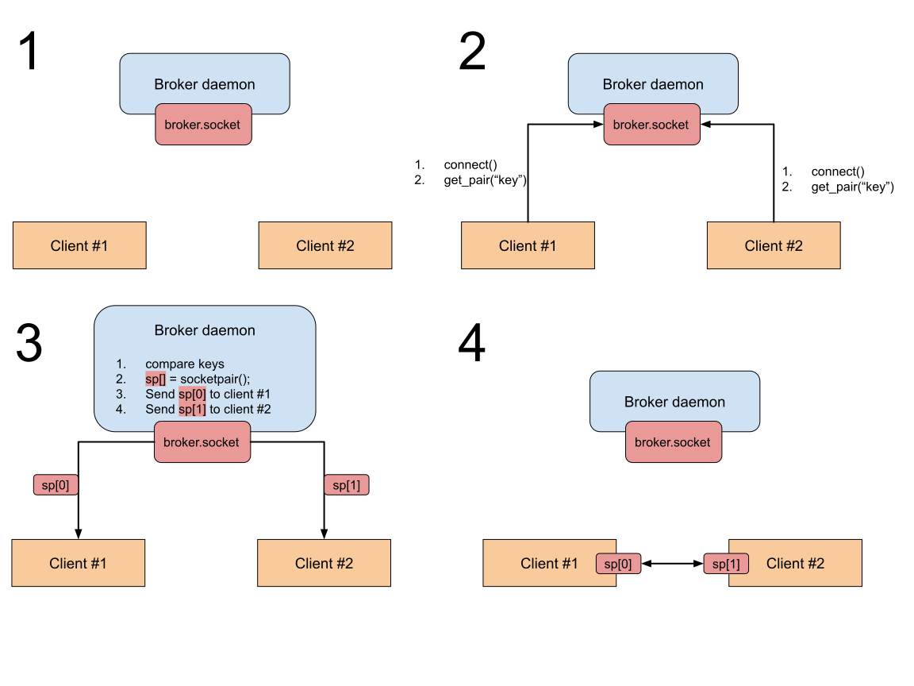

..
    Copyright (c) 2021 Ilya Maximets <i.maximets@ovn.org>

    Licensed under the Apache License, Version 2.0 (the "License");
    you may not use this file except in compliance with the License.
    You may obtain a copy of the License at

        http://www.apache.org/licenses/LICENSE-2.0

    Unless required by applicable law or agreed to in writing, software
    distributed under the License is distributed on an "AS IS" BASIS,
    WITHOUT WARRANTIES OR CONDITIONS OF ANY KIND, either express or implied.
    See the License for the specific language governing permissions and
    limitations under the License.

=================
SocketPair Broker
=================

``SocketPair Broker`` is a daemon that provides a pairing service by
establishing socket-based connections between clients.

How Does it work?
-----------------

``SocketPair Broker`` creates a single socket (broker-socket) and waits for
connections on this socket from applications (clients).

Exact communication protocol is described by `SocketPair Broker Protocol
<socketpair-broker-proto-spec.rst>`__.  Below is a more human-readable and
visual approximation.

Approximate workflow for the broker daemon:
+++++++++++++++++++++++++++++++++++++++++++

#. Create socket.

#. Wait for connections.

#. Accept one client connection.

#. Receive the ``key`` from the client.

#. If daemon already has established connection with some other client that
   provided the same ``key``:

   a. Create a new pair of connected sockets.
      (e.g. by ``socketpair()`` syscall)

   b. Send one side of the socket pair to the first client.

   c. Send other side of the socket pair to the second client.

   d. Disconnect both clients.

#. Go to step #2.

Typical workflow of the client application:
+++++++++++++++++++++++++++++++++++++++++++

#. Connect to the broker-socket.

#. Send pairing request to broker including the ``key``.

#. Wait for reply from the broker daemon containing a new socket.

#. Close connection with the broker.

#. Use received socket to communicate with the other application that used same
   ``key`` while connecting to broker.

Graphical workflow:
+++++++++++++++++++

